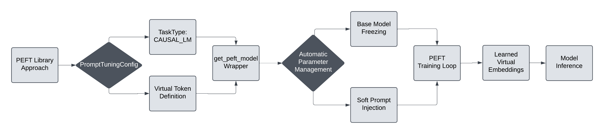
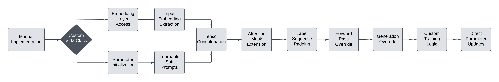

# Prompt Tuning Experiment Log

Prompt tuning experiments on modern VLMs like Qwen2.5-VL, Pixtral 12B, and Phi 3.5 Vision showed fundamental architectural incompatibilities with traditional soft prompt tuning approaches. 

The core issue is that these models use **monolithic decoder architectures** where vision and text are fused internally, making clean prompt injection difficult.

## Architectural Challenges

### Model Architecture Incompatibilities

| Model | Architecture Type | Critical Limitation |
| ----- | ----- | ----- |
| **Qwen2.5-VL 7B** | Decoder-only VLM | Vision and text inputs are fused inside a monolithic forward pass. No `.vision_model`, `.get_input_embeddings()` doesn't exist or fails in some wrappers. |
| **Pixtral 12B** | Vision-augmented decoder | Also decoder-only. Vision input and text tokens go through a shared stack. No exposed modular vision encoder. |
| **Phi 3.5 Vision 4.2B** | Vision + chat-style decoder | `<image>` token triggers vision embedding internally. You can't intercept or prepend prompts in a clean way. Structured templates interfere with prompt injection. |

### Why Soft Prompt Tuning Fails

> **❌ Do *not* expose separate vision/text modules or clean embedding injection points**

The monolithic decoder architecture and internal vision-text fusion make **soft prompt tuning difficult, error-prone, and often ineffective** in models like Qwen2.5-VL, Pixtral, and Phi 3.5 Vision.

## Key Failure Points

### Token Injection Blockers

| Model | Token Injection Blocker | Risk if Misaligned |
| ----- | ----- | ----- |
| Qwen2.5-VL | Chat template + `<image>` expectation | Soft prompts ignored, vision lost |
| Pixtral | No separation of image/text inputs | Prompt goes unnoticed |
| Phi 3.5 Vision | Strict `<image>` positioning + chat roles | Breaks tokenizer or image path |

### Requirements for Clean Prompt Attachment

In soft prompt tuning, you **prepend learnable virtual tokens** (i.e., soft prompts) to the input sequence. For this to work:

1. The model must interpret those tokens as part of the input context
2. The tokenizer must not reformat, truncate, or rearrange them
3. The model's architecture must not assume a strict prompt template (e.g., chat history, system-role split)

## Experiment Log

### Qwen2.5-VL PEFT-Based Approach

| Issue | Explanation |
| ----- | ----- |
| **Vision Features Fused** | PEFT injects prompts only into **text**, but Qwen's generation heavily relies on **vision input**, which remains untouched |
| **Inaccessible Vision Encoder** | Cannot prepend visual soft prompts (like in CoOp) — no `vision_model()` access |
| **inputs_embeds Injection Limited** | Prompt tuning injects into decoder only. For captioning, much of the semantic control happens **post-fusion** |

### Phi 3.5 Vision Manual Approach

| Issue | Explanation |
| ----- | ----- |
| **`<image>` Token Semantics** | Phi's image understanding depends on how the `<image>` token is embedded and interpreted — not influenced by soft prompt tuning |
| **Decoder-Only Architecture** | Phi generates in fully autoregressive way; soft prompts at beginning **may get diluted** during long sequence generation |
| **Prompt Position Sensitivity** | Without exact alignment of prompt, label shifts, and tokenization, soft prompt interferes with correct loss computation |
| **No Visual Adaptation** | Vision stream never tuned or conditioned, limiting prompt impact in vision-language tasks |
| **No Measurable Learning** | Model likely "ignores" the prompt if not deeply entangled with image-conditioning pathway |

## Conclusion and Recommendations

The experiment highlights the need for VLM-specific prompt tuning methods that account for the architectural differences between traditional CLIP-style models and modern decoder-only VLMs.
